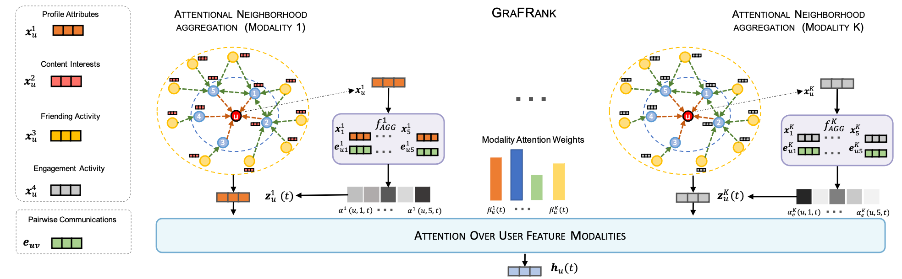

## Graph Neural Networks for Friend Ranking in Large-scale Social Platforms

##### Contributors: [Aravind Sankar](http://asankar3.web.engr.illinois.edu/) (asankar3@illinois.edu).

> Aravind Sankar, Yozen Liu, Jun Yu, and Neil Shah, "Graph Neural Networks for Friend Ranking in Large-scale Social 
Platforms", The Web Conference 2021, 
<b>WWW
 2021</b>, April 19–23, 2021, Ljubljana, Slovenia.

This repository contains a PyTorch implementation of  ****GraFrank**** -  a graph neural 
network architecture 
for multi-faceted friend ranking with
multi-modal node features and pairwise link features in social networks.
 ****GraFrank**** uses two modules: modality-specific neighbor aggregation and cross-modality attention to inductively compute 
user 
representations in a dynamic friendship graph.


Since we are unable to publicly share the Snapchat datasets and industry-scale implementation of ****GraFrank**** (privacy 
reasons), we 
implement the core modules of ****GraFank**** using a popular geometric deep learning libray [PyTorch Geometric](https://pytorch-geometric.readthedocs.io/en/latest/). 
 



### Requirements
The code has been tested running under Python 3.6 using  PyTorch 1.8.1 and PyTorch Geometric 1.7.0
(along with their 
dependencies). 

To guarantee that you have the right package versions, you can use Anaconda to set up a virtual environment and 
following the instructions [here](https://github.com/rusty1s/pytorch_geometric). 


### Input Format
This repository on a sample dataset based on the ``Cora`` citation network. To ensure compatibility with link 
features, we use dummy features in the code. 
 
In order to use your own data, you should use the data format of PyTorch Geometric and may need to update the data 
loader if the graph is dynamic.

### Repository Organization
- ``models/`` contains:
    - GraFRank model (``GraFRank.py``);
    - GraphSAGE model (``SAGE.py``);
    - modality-specific aggregators and cross-modality attention modules in GraFrank (``layers.py``)       
    
- ``utils/`` contains:
    - mini-batch loader for sampling positive and negative examples for model training (``sampler.py``);

### Running the Model
To train and evaluate the model, please run
```bash
python train.py
```
 
 
## Reference
 If you make use of this code or the GraFrank algorithm in your work, please cite the following paper:

```
@inproceedings{sankar2021graph,
  title     = {Graph Neural Networks for Friend Ranking in Large-scale Social Platforms},
  author={Sankar, Aravind and Liu, Yozen and Yu, Jun and Shah, Neil},
  doi       = {10.1145/3442381.3450120},
  booktitle = {Proceedings of The Web Conference 2021},
  year = {2021}
}
```


